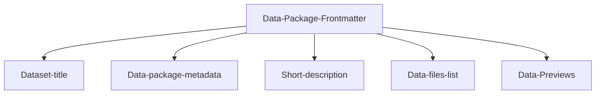

---
datapackage:
  title: Template dataset site
  description: This is a template for publishing your data with Datahub Cloud.
  licenses:
  - path: http://opendatacommons.org/licenses/pddl/
    title: Open Data Commons Public Domain Dedication and License v1.0
  resources:
  - path: data.csv
    title: C02 PPM per decade
    name: c02-per-decade
    format: csv
    schema:
      fields:
      - name: year
        type: date
      - name: co2
        type: number
---

## Overview

Welcome to the body (= the README.md/index.md part) of your dataset site. Everything above this Overview section is part of the Data package front matter. Below is an overview of what's included in the data package frontmatter:

Feel free to customize it when publishing your own data. 

Below the frontmatter 

We can add a chart:

<LineChart
  data="./data.csv"
  title="C02 per decade"
  xAxis="year"
  yAxis="co2"
/>
