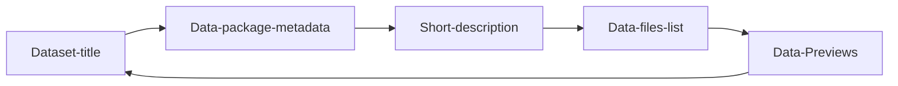

---
datapackage:
  title: Template dataset site
  description: This is a template for publishing your data with Datahub Cloud.
  licenses:
  - path: http://opendatacommons.org/licenses/pddl/
    title: Open Data Commons Public Domain Dedication and License v1.0
  resources:
  - path: data.csv
    title: C02 PPM per decade
    name: c02-per-decade
    format: csv
    schema:
      fields:
      - name: year
        type: date
      - name: co2
        type: number
---

## Overview

Everything above this section is part of the Data package front matter. Feel free to customize it when publishing your own data. 

In the following  sections, we are going to explore how you can enhance your dataset:

We can add a chart:

<LineChart
  data="./data.csv"
  title="C02 per decade"
  xAxis="year"
  yAxis="co2"
/>
